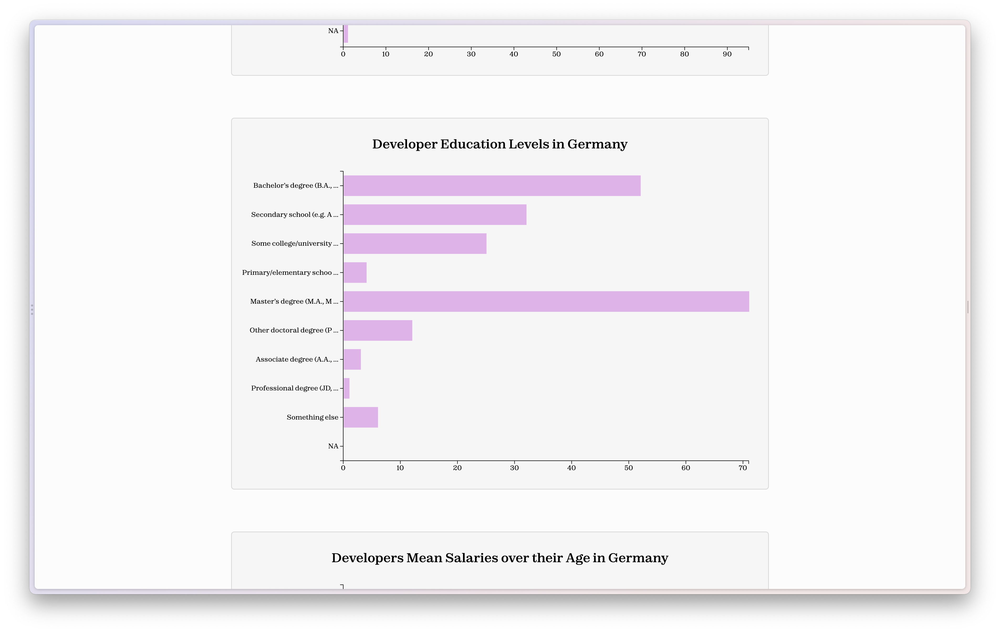

# Stackoverflow Survey 2021 on a World Map

by @motcodes

[Link to Website](https://stackoverflow-2021-d3-motcodes.vercel.app/)

This website uses the [Stackoverflow Survey Dataset](https://insights.stackoverflow.com/survey/) from 2021 and visualizes it over a world map using the [D3](https://d3js.org/) toolkit. For a simpler interaction and a declarative style of code I chose [Svelte Kit](https://kit.svelte.dev/) as my framework of choice. The pros of svelte are the "just javascript" style of code without any special hooks or functions like in React and it's clean component approach where you can only write one component in one file.

## Developing

Once you've created a project and installed dependencies with `npm install` (node version 16 is required), start a development server:

```bash
npm run dev
```

## Building

To create a production version of your app:

```bash
npm run build
```

You can preview the production build with `npm run preview`.

## File System

The `src/` folder contains all the important files. There you can find `charts/` which has the four different row charts, `lib/` which holds constants and functions, `routes/` which represent the available routes the website can go to, and on the root there are a few more smaller components like the `tooltip.svelte`.

## Stackoverflow Data

The Stackoverflow Data contains many many question which are answered by developers like the languages they have used, where they are from and much more.
I decided to filter this data based on the developers country. There you can see the how old the developers are, their education level and then how these two values compare to the salary data, depending on the country.
Teh Aim is to see the differences in Age and Degree and Salary, showcasing that you don't always need the degree or age to earn big bucks. The Dataset was shorten but we can see some differences like in Germany most devs have a Masters Degree but don't earn over 70k. While Canada doesn't have this many Masters Degrees but they earn a lot more, up to 240k Euro.

### Dataset

| ResponseId | MainBranch                     | Employment                                           | Country  | EdLevel                                                                            | Age1stCode    | LearnCode                                                       | DevType           | OrgSize            | Currency          | CompTotal | CompFreq | LanguageHaveWorkedWith                        | LanguageWantToWorkWith | DatabaseHaveWorkedWith | DatabaseWantToWorkWith | PlatformHaveWorkedWith | PlatformWantToWorkWith | WebframeHaveWorkedWith | WebframeWantToWorkWith | MiscTechHaveWorkedWith | MiscTechWantToWorkWith | ToolsTechHaveWorkedWith | ToolsTechWantToWorkWith | NEWCollabToolsHaveWorkedWith | NEWCollabToolsWantToWorkWith | OpSys | NEWStuck                                                                                          | NEWSOSites     | SOVisitFreq            | SOAccount | SOPartFreq                      | SOComm          | NEWOtherComms | Age             | Gender | Trans | Sexuality               | Ethnicity                    | Accessibility     | MentalHealth      | ConvertedCompYearly |
| ---------- | ------------------------------ | ---------------------------------------------------- | -------- | ---------------------------------------------------------------------------------- | ------------- | --------------------------------------------------------------- | ----------------- | ------------------ | ----------------- | --------- | -------- | --------------------------------------------- | ---------------------- | ---------------------- | ---------------------- | ---------------------- | ---------------------- | ---------------------- | ---------------------- | ---------------------- | ---------------------- | ----------------------- | ----------------------- | ---------------------------- | ---------------------------- | ----- | ------------------------------------------------------------------------------------------------- | -------------- | ---------------------- | --------- | ------------------------------- | --------------- | ------------- | --------------- | ------ | ----- | ----------------------- | ---------------------------- | ----------------- | ----------------- | ------------------- |
| 1          | I am a developer by profession | Independent contractor, freelancer, or self-employed | Slovakia | Secondary school (e.g. American high school, German Realschule or Gymnasium, etc.) | 18 - 24 years | Coding Bootcamp;Other online resources (ex: videos, blogs, etc) | Developer, mobile | 20 to 99 employees | EUR European Euro | 4800      | Monthly  | C++;HTML/CSS;JavaScript;Objective-C;PHP;Swift | Swift                  | PostgreSQL;SQLite      | SQLite                 | NA                     | NA                     | Laravel;Symfony        | NA                     | NA                     | NA                     | NA                      | NA                      | PHPStorm;Xcode               | Atom;Xcode                   | MacOS | Call a coworker or friend;Visit Stack Overflow;Go for a walk or other physical activity;Google it | Stack Overflow | Multiple times per day | Yes       | A few times per month or weekly | Yes, definitely | No            | 25-34 years old | Man    | No    | Straight / Heterosexual | White or of European descent | None of the above | None of the above | 62268               |

This is the first entry of the stackoverflow dataset. Not everybody anwsered all the questions which is fine since we only need 3, the Age, EdLevel, and the ConvertedCompTotal for our visualization.

## Results

### Homepage

Start view of the world map

view of the world map when hovering over a country

view of the world map when zoomed in


### Country Page

First Rowchart containing the Age Data

Rowchart containing the Education Level Data

Rowchart containing the Age Data and comparing it to the Salary

Rowchart containing the Education Level Data and comparing it to the Salary

